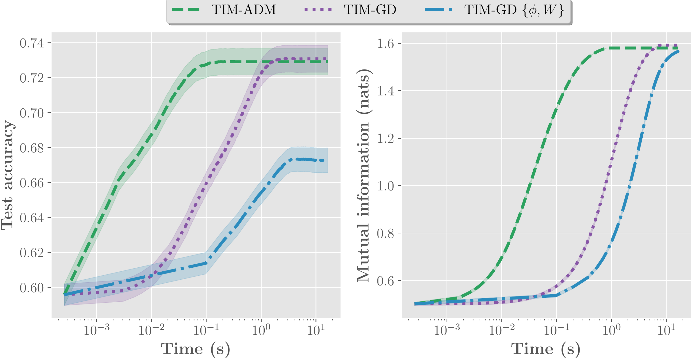

# TIM: Transductive Information Maximization


##  Introduction
We introduce Transductive Infomation Maximization (TIM) for few-shot learning. Our method maximizes the mutual information between the query features and predictions of a few-shot task, subject
to supervision constraint from the support set. Results provided in the paper can be reproduced with this repo. Code was developped under python 3.8.3 and pytorch 1.4.0. The code is parallelized over tasks (which makes the execution of the 10'000 tasks very efficient).


## 1. Getting started


### 1.1 Quick installation (recommended)

#### 1.1.1 Download datasets
Use the provided script:
```python
python -m scripts.downloads.download_data
```
For Tiered-Imagenet, please download the zip file at https://drive.google.com/drive/folders/163HGKZTvfcxsY96uIF6ILK_6ZmlULf_j?usp=sharing, and unzip it into the data/ folder.

#### 1.1.2 Download models

We also put the cross-entropy trained models at your disposal. To download the models
```python
python -m scripts.downloads.download_models
```
#### 1.1.3 Download the environment

For higher reproducibility, we provide the environment that was used to obtain our results. To download it, execute:
```python
python -m scripts.downloads.download_environment
```

### 1.2 Manual installation

If you face an issue with the previous scripts, everything required can be downloaded manually at https://drive.google.com/open?id=1KicPkBFOQQJptWmSh3NcE4tHl2ZKD87B Each dataset.zip must be extracted inside the data/ folder. The checkpoints.zip files must be extracted at the root of the directory, same for env.zip file.

## 2. Train models (optional)

Instead of using the pre-trained models, you may want to train the models from scratch.
Before anything, don't forget to activate the downloaded environment:
```python
source env/bin/activate
```
Then to visualize the results, turn on your local visdom server:
```python
python -m visdom.server -port 8098
```
and open it in your browser : http://localhost:8098/ . Then, for instance, if you want to train a Resnet-18 on mini-Imagenet, go to the root of the directory, and execute:
```python
bash scripts/train/resnet18.sh
```

## 3. Reproducing the main results

Before anything, don't forget to activate the downloaded environement:
```python
source env/bin/activate
```

### 3.1 Benchmarks (Table 1. in paper)


|(1 shot/5 shot)|     Arch    | mini-Imagenet | Tiered-Imagenet | CUB  |
| 	   ---      |      ---    |      ---      |	   ---          |  --- |
| TIM-ADM       |   Resnet-18 | 73.6 / **85.0**  | **80.0** / **88.5** |
| TIM-GD        |   Resnet-18 |  **73.9** / **85.0**  | 79.9 / **88.5**  |
| TIM-ADM       |   WRN28-10  |  77.5 / 87.2  | 82.0 / 89.7     | |
| TIM-GD        |   WRN28-10  |  **77.8** / **87.4**  | **82.1** / **89.8**   |

To reproduce the results from Table 1. in the paper, use the bash files at scripts/evaluate/. For instance, if you want to reproduce the methods on mini-Imagenet, go to the root of the directory and execute:
```python
bash scripts/evaluate/<tim_adm or tim_gd>/mini.sh
```
This will reproduce the results for the three network architectures in the paper (Resnet-18/WideResNet28-10/DenseNet-121). Upon completion, exhaustive logs can be found in logs/ folder


### 3.2 Domain shift (Table 2. in paper)

|(5 shot)       |     Arch    |        CUB -> CUB     | mini-Imagenet -> CUB |
| 	   ---      |      ---    |        ---            |	       ---           |
| TIM-ADM       |   Resnet18  |         90.7          |        70.3          |
| TIM-GD        |   Resnet18  |       **90.8**        |      **71.0**        |

If you want to reproduce the methods on CUB -> CUB, go to the root of the directory and execute:
```python
bash scripts/evaluate/<tim_adm or tim_gd>/cub.sh
```
If you want to reproduce the methods on mini -> CUB, go to the root of the directory and execute:
```python
bash scripts/evaluate/<tim_adm or tim_gd>/mini2cub.sh
```

### 3.3 Tasks with more ways (Table 3. in paper)

If you want to reproduce the methods with more ways (10 and 20 ways) on mini-Imagenet, go to the root of the directory and execute:

```python
bash scripts/evaluate/<tim_adm or tim_gd>/mini_10_20_ways.sh
```

|(1 shot/5 shot)|    Arch     |       10 ways     |       20 ways        |
| 	   ---      |     ---     |        ---        |	       ---           |
| TIM-ADM       |   Resnet18  |   56.0 / **72.9** |  **39.5** / 58.8     |
| TIM-GD        |   Resnet18  |**56.1** / 72.8    |    39.3 / **59.5** |


### 3.4 Ablation study (Table 4. in paper)

If you want to reproduce the 4 loss configurations of on mini-Imagenet, Tiered-Imagenet and CUB, go to the root of the directory and execute:
```python
bash scripts/ablation/<tim_adm or tim_gd or tim_gd_all>/weighting_effect.sh
```
for respectively TIM-ADM, TIM-GD {W} and TIM-GD {phi, W}.




## Contact

For further questions or details, reach out to Malik Boudiaf (malik.boudiaf.1@etsmtl.net)

## Acknowledgements

We would like to thank the authors from SimpleShot code https://github.com/mileyan/simple_shot and LaplacianShot https://github.com/imtiazziko/LaplacianShot for giving access to their pre-trained models and to their codes from which this repo was inspired.
